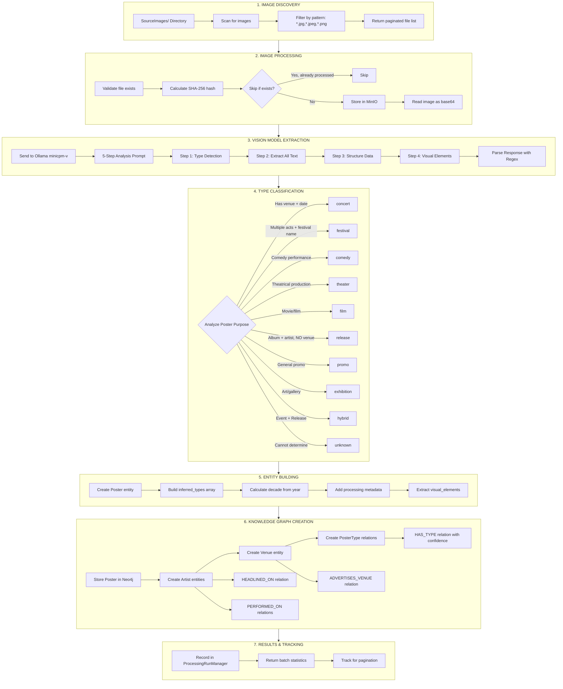
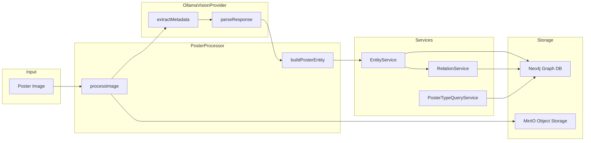
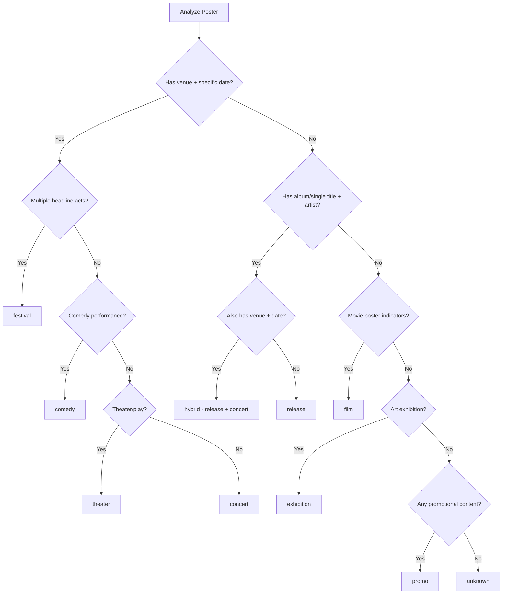
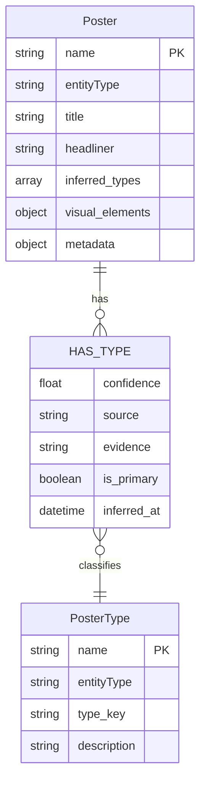

# Poster Processing Pipeline

## Overview Flowchart



## Detailed Component Flow



## Type Classification Logic



## HAS_TYPE Relationship Structure



## Key Files

| Component | File | Purpose |
|-----------|------|---------|
| PosterProcessor | `src/image-processor/PosterProcessor.ts` | Main orchestrator |
| OllamaVisionProvider | `src/image-processor/providers/OllamaVisionProvider.ts` | Vision model + parsing |
| VisionModelFactory | `src/image-processor/VisionModelFactory.ts` | Provider factory |
| processPosterBatch | `src/server/handlers/toolHandlers/processPosterBatch.ts` | MCP tool + KG creation |
| PosterTypeQueryService | `src/core/services/PosterTypeQueryService.ts` | Type queries |
| EntityService | `src/core/services/EntityService.ts` | Entity CRUD |
| RelationService | `src/core/services/RelationService.ts` | Relation CRUD |

## Configuration

Located in: `instances/posters/config/instance-config.json`

```json
{
  "processingConfig": {
    "providerType": "vision",
    "providerSettings": {
      "vision": {
        "model": "minicpm-v",
        "provider": "ollama",
        "baseUrl": "http://localhost:11434",
        "confidenceThreshold": 0.7,
        "options": {
          "temperature": 0.1,
          "maxTokens": 2048
        }
      }
    },
    "batchSize": 5,
    "maxConcurrent": 2
  }
}
```

## Processing Entry Points

1. **MCP Tool**: `process_poster_batch` - for interactive processing
2. **Script**: `scripts/poster-processing/process-posters.ts` - for bulk processing
3. **API**: `POST /api/processing/batch` - for REST API access
